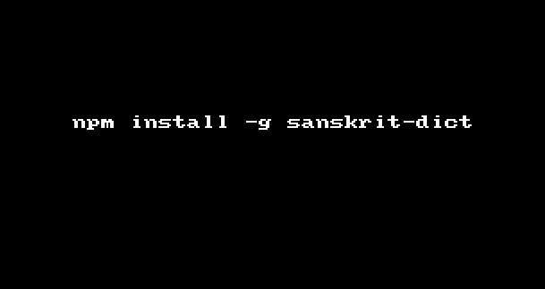

# sanskrit-dict [](https://travis-ci.org/hemanth/sanskrit-dict)

> Sanskrit dictionary.


## Install

```
$ npm install --save sanskrit-dict
```


## Usage

```js
var sanskritDict = require('sanskrit-dict');

sanskritDict('aum',function(err,meaning){
	console.log(meaning); //{'aum': 'Primordial Sound'}
});

```

## CLI

```sh
$ sanskrit-dict su
su means good, used as a prefix.

$ echo 'aum' | sanskrit-dict

```

## GIF




## License

MIT © [Hemanth.HM](http://h3manth.com)
